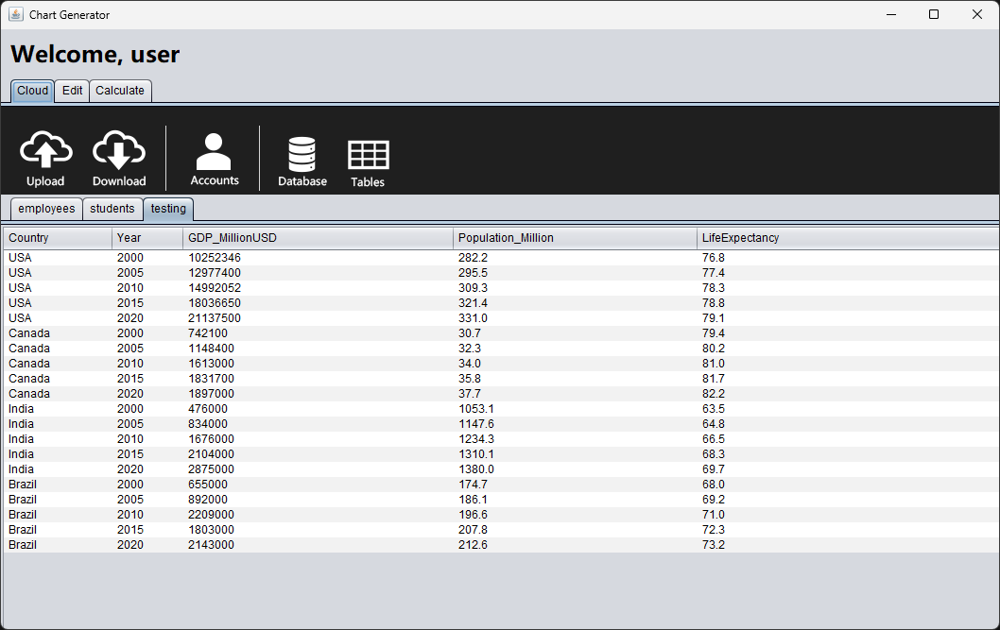
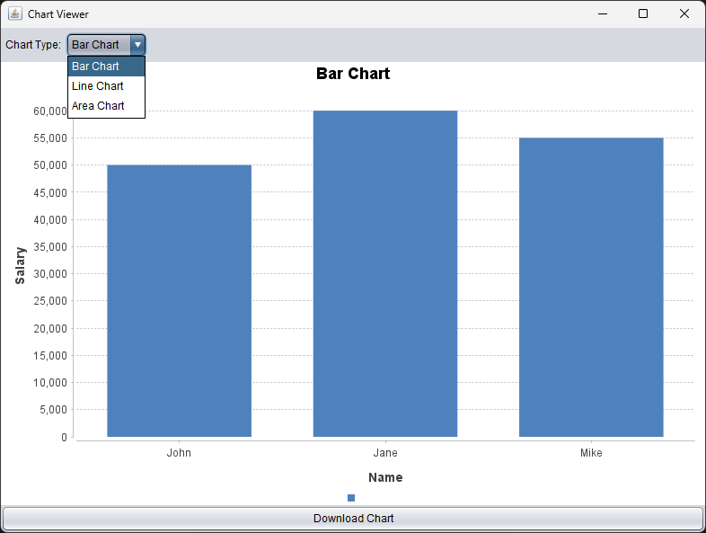
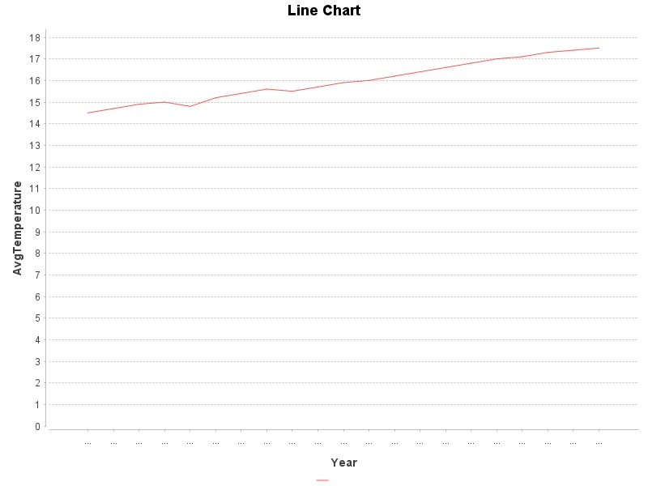

# 📊 Chart Generator — Data Visualizer App

A desktop application built with **Java Swing**, **JFreeChart**, and **MySQL/MariaDB**.  
It allows users to upload CSV datasets, visualize data as bar, line, area, or pie charts, and export both tables and charts locally.

---

## ✨ Features

- 🔐 User login with SQL authentication
- 📂 Upload `.csv` files and automatically create SQL tables
- 📋 Display data in styled `JTable`
- 📊 Generate and switch between:
  - Bar Chart
  - Line Chart
  - Area Chart
- 💾 Export:
  - Chart image as `.jpeg`
  - Table data as `.csv`
- 🎨 Enhanced UI with dropdowns, tooltips, and color themes

---

## Samples:

